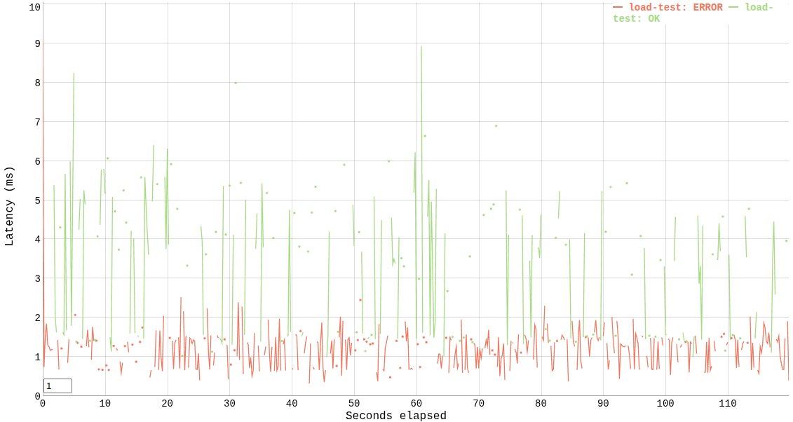

# PR Reviewer Assignment Service (Test Task, Fall 2025)

Практическое задание в рамках отбора на стажировку Авито

### Описание задачи

Необходимо реализовать сервис, который назначает ревьюеров на PR из команды автора, позволяет выполнять переназначение ревьюверов и получать список PR’ов, назначенных конкретному пользователю, а также управлять командами и активностью пользователей. После merge PR изменение состава ревьюверов запрещено.

### Общие вводные

**Пользователь (User)** — участник команды с уникальным идентификатором, именем и флагом активности `isActive`.  
**Команда (Team)** — группа пользователей с уникальным именем.  
**Pull Request (PR)** — сущность с идентификатором, названием, автором, статусом `OPEN|MERGED`и списком назначенных ревьюверов (до 2).

1. При создании PR автоматически назначаются **до двух** активных ревьюверов из **команды автора**, исключая самого автора.
2. Переназначение заменяет одного ревьювера на случайного **активного** участника **из команды заменяемого** ревьювера.
3. После `MERGED` менять список ревьюверов **нельзя**.
4. Если доступных кандидатов меньше двух, назначается доступное количество (0/1).

### Условия

* Использовать [этот](docs/openapi.yaml) API.
* Объём данных умеренный (до 20 команд и до 200 пользователей), RPS — 5, SLI времени ответа — 300 мс, SLI успешности — 99.9%.
* Пользователь с `isActive = false` не должен назначаться на ревью.
* Операция merge должна быть **идемпотентной** — повторный вызов не приводит к ошибке и возвращает актуальное состояние PR.
* Сервис и его зависимости должны подниматься командой **docker-compose up**. Если решение предусматривает миграции, они также должны применяться при выполнении этой команды. Сервис должен быть доступен на порту 8080.

### Дополнительные задания

* Добавить простой эндпоинт статистики (например, количество назначений по пользователям и/или по PR).
* Провести нагрузочное тестирование полученного решения и приложить краткие результаты тестирования к решению.
* Добавить метод массовой деактивации пользователей команды и безопасную переназначаемость открытых PR (стремиться уложиться в 100 мс для средних объёмов данных).
* Реализовать интеграционное или E2E-тестирование.
* Описать конфигурацию линтера.

## Реализация

Приложение реализовано полностью согласно основным требованиям, также добавлены нагрузочное и интеграционное тестирование и конфигурация golangci-lint. Кроме того, поддерживается Swagger UI с заданной спецификацией OpenAPI.

Конфигурация сервиса задается через [yaml-файл](config/config.yaml).

## API

Для загрузки Swagger UI в браузере необходимо перейти по пути ```/swagger/index.html```.

По умолчанию для клиентских запросов прослушивается порт 8080. Изменить его можно в [файле конфигурации](config/config.yaml) (поле ```http.address```).

## Запуск приложения

Сборка Docker-образа приложения:

```bash
make build_services
```

Развертывание приложения совместно с базой данных:

```bash
make launch_services
```

Развертывание приложения, базы данных и запуск интеграционных тестов:
```bash
make launch_services_with_tests
```

Остановка всех сервисов и удаление контейнеров:

```bash
make stop_services
```

## Нагрузочное тестирование

Для проверки работоспособности сервиса под заданной нагрузкой была написана вспомогательная [программа](load/vegeta.go) при помощи библиотеки Vegeta. Сервис тестировался с 5 RPS в течение 120 cекунд.  
Как видно из отчета ниже, реализованный сервис успешно справляется с нагрузкой и соблюдает необходимые SLI.

### Отчет Vegeta

```
Requests      [total, rate, throughput]  600, 5.01, 1.89
Duration      [total, attack, wait]      1m59.800580723s, 1m59.80019579s, 384.933µs
Latencies     [mean, 50, 95, 99, max]    2.031531ms, 1.445465ms, 5.310366ms, 6.522122ms, 9.169656ms
Bytes In      [total, mean]              101616, 169.36
Bytes Out     [total, mean]              90868, 151.45
Status Codes  [code:count]               200:148  201:78  400:193  404:150  409:31  
Error Set:
404 Not Found
400 Bad Request
409 Conflict
```

### График запросов (зеленый — коды 2XX, красный — коды 4XX)



## Вопросы и уточнения по условиям/реализации

### Вопрос 1

Какие индексы следует создать для таблиц базы данных?

**Решение**

После анализа всех SQL-запросов было решено создать следующие индексы (помимо первичных ключей):
* **users (team_name, is_active)** — для эффективной фильтрации
* **reviewers (pr_id)** — для получения списка ревьюеров PR
* **reviewers (user_id, pr_id)** — обеспечивает максимальную эффективность для ряда запросов, т. к. является покрывающим

### Вопрос 2

В описании запроса ```/team/add``` упоминается "создание/обновление пользователей". Как это должно быть реализовано?

**Решение**

Наиболее логичная схема исполнения запроса следующая:
* создается новая команда, если уже существовала — возвращаем код 400
* создаются новые пользователи, если пользователи с некоторыми ID уже существовали — обновляем информацию о них вместо вставки (upsert), с изменением команды

### Вопрос 3

Имеет ли смысл использовать кэширование запросов?

**Решение**

С учетом того, что сервис используется довольно локальной группой пользователей и имеет низкий ожидаемый RPS, кэширование в данном случае избыточно.

### Вопрос 4

Модель PR имеет поле ```createdAt```, но его по какой-то причине нет в примере ответа.

**Решение**

В реализации поле ```createdAt``` возвращается всегда.  
Поле ```mergedAt``` возвращается только в случае, если PR уже merged.
